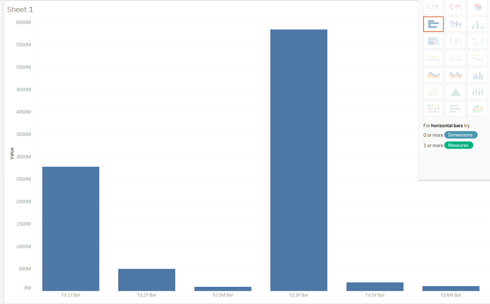
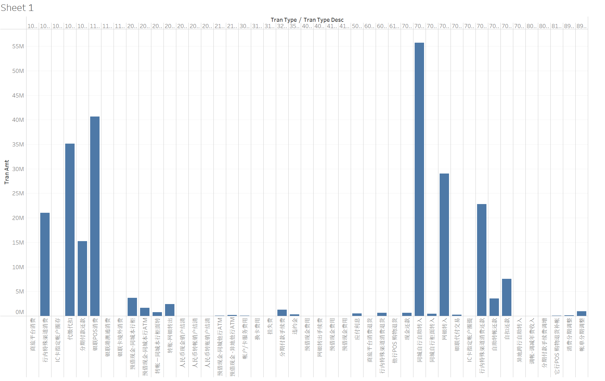

## 数据集成相关实践代码

具体细节参考每一个子文件夹，本人不保证代码的完全正确性，`Flink`消费逻辑处就存在问题，写入`clickhouse`是否每张表格都正确也需要加以识别。

相关环境：
- `Ubuntu20.04`
- `java1.8`
- `hadoop 2.7.4`
- `spark 2.3.3(内置scala2.11.8)`
- `clickhouse最新`
- `kafka`对应`scala2.11`
- `flink-1.13.5-bin-scala`

可视化工具：
- `Tableau`

## 部分可视化效果

### 离线数据部分

**对 pri_cust_asset_info 存款汇总信息表进行分析**

可以得出结论，相较于其他存款方式，定期一年和定期三年的存款方式更加受到客户的喜爱。同时定期存款的数额往往是较为巨大的。

### 流式数据部分

**展示贷记卡交易各个类型的总额，以调整业务安排**

